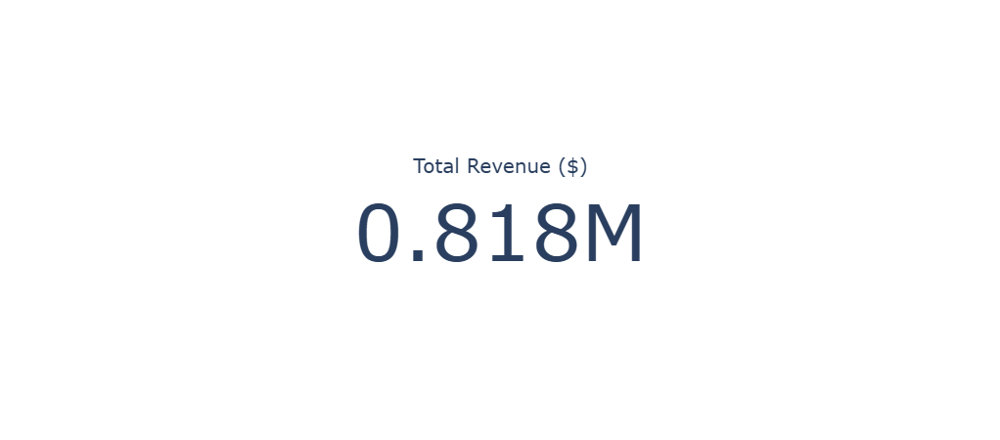
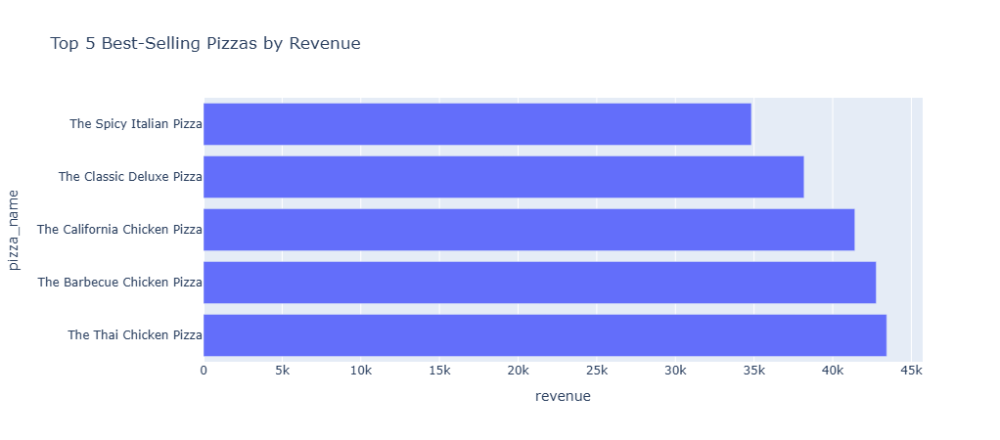
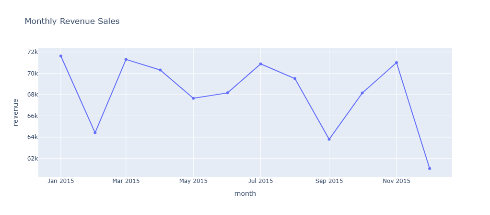
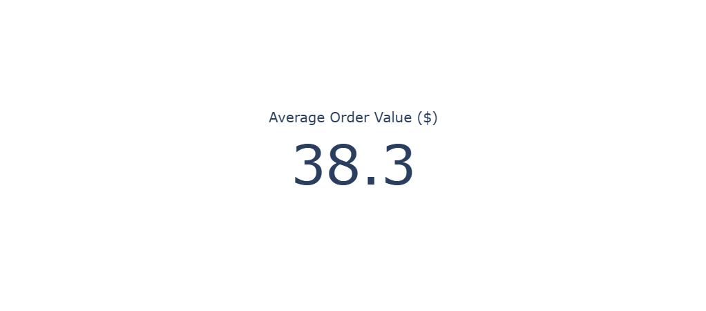
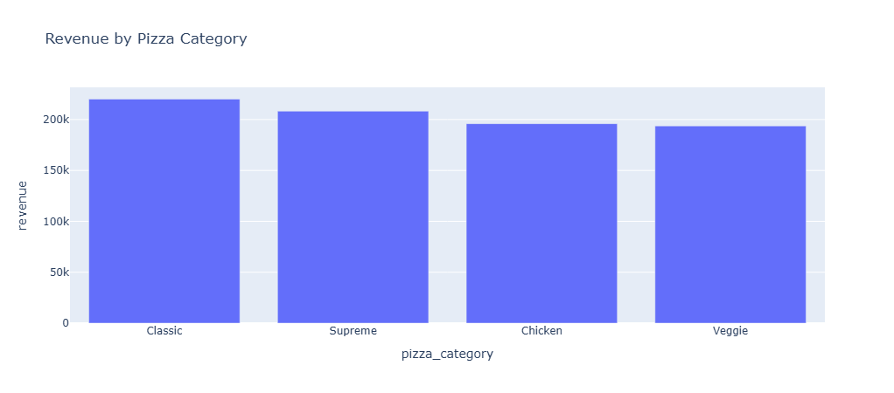
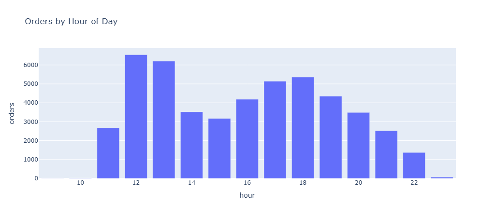
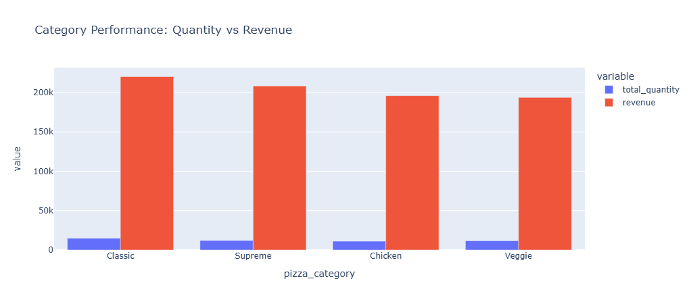

# 🍕 Pizza Sales Analytics (DuckDB + Pandas + Plotly)

## 📌 Overview

This project analyzes a pizza sales dataset using a modern data stack:

* **DuckDB** for fast SQL-based querying
* **Pandas** for data handling
* **Plotly Express** for interactive visualizations

The goal is to extract business insights and present them through clear, interactive charts.

---
## ⚠️ Interactive Plotly Charts

> This project uses Plotly for interactive visualizations.

>GitHub does not execute JavaScript inside notebooks or markdown files, therefore Plotly charts displayed in this repository appear only as static images.

>To explore the full interactive experience (zooming, hovering, filtering, and panning), run the notebook locally.
---
## 📷 Dashboard Preview

### Total Revenue



### Top 5 Best Selling Pizzas



### Monthly Revenue



### Average Order Value (AOV)



### Sales By Category



### Peak Ordering Hours



### Category Performance


---

## 📊 Key Analyses

* **Total Revenue** – Overall business performance (KPI)
* **Top 5 Pizzas by Revenue** – Best-selling products
* **Monthly Sales Trend** – Revenue over time (seasonality)
* **Peak Ordering Hours** – Customer behavior by time of day
* **Average Order Value (AOV)** – Revenue efficiency per order
* **Sales by Category** – Category-level performance
* **Sales by Size** – Customer size preferences

---

## 🧠 Key Insights

* A small number of pizzas generate a large portion of revenue
* Orders peak during specific hours → useful for staffing decisions
* Certain categories drive higher revenue despite lower volume
* Customer preferences for size can inform inventory strategy

---

## 📂 Project Structure

```
pizza-analytics/
│
├── notebook/data_insights.ipynb      # Main analysis
├── data/pizza_sales.csv              # Dataset
├── README.md
└── requirements.txt
```

---

## 🚀 How to Run

```bash
pip install pandas duckdb plotly
```

Open the notebook:

```bash
jupyter notebook
```

Run all cells to reproduce the analysis.

---
